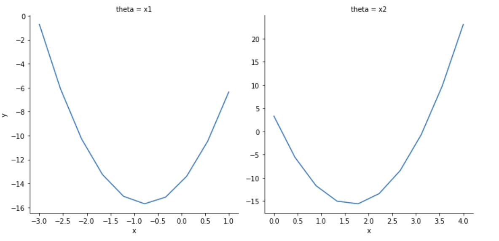

# **projplot**: Utilities for Creating Projection Plots

**projplot** provides a set of tools to assess whether or not an optimization algorithm has converged to a local optimum.  Its main function does this by visualizing the "projection plots" of the objective function `f(x)` -- that is, by plotting `f` against each coordinate of `x` with the other coordinates fixed at the corresponding elements of the candidate optimal solution `x_opt`.  

This package has a similar goal to the R package [**optimCheck**](https://github.com/mlysy/optimCheck).

## Installation

This package is available on [PyPi](https://pypi.org/project/projplot/) and can be installed as follows:

```bash
pip install projplot
```

## Documentation

Read the documentation online at http://projplot.readthedocs.io/

Alternatively, build the documentation from the `docs/` folder

```bash
pip install sphinx
cd docs/
make html
```

## Example

An overview of the package functionality is illustrated with the following example. Let `Q(x) = x^TAx - 2b^Tx` denote a quadratic objective function in `x` is in the d-dimensional real space. If `A` is a positive-definite matrix, then the unique minimum of `Q(x)` is `x_opt =A^{-1}b` (A inverse * b). 

For example, suppose we have

```python
import numpy as np

A = np.array([[3,2],
	          [2,7]])
b = np.array([1,10])
```

Then we have that the optimal solution is `x_opt = (-0.765, 1.647)`. Now, **projplot** allows us to complete a visual check. As the user of this program, you will need to provide the following information:

* Objective function (`obj_fun`): This can be either a vectorized or non-vectorized function. 
*  Optimal values (`x_opt`): This will be the optimal solution for your function. 
*  Upper and lower bounds for each parameter (`x_lims`): This will provide an initial range of values to observe.
*  Parameter names (`x_names`): These are the names of your parameters, i.e. theta, mu, sigma
*  Number of points to plot for each parameter (`n_pts`): This is the number of points that each parameter will be evaluated at for their respective plot. 

### Setup

```python
# Optimal values
x_opt = np.array([-0.76470588,  1.64705882])

# Upper and lower bounds for each component of x
x_lims = np.array([[-3., 1], [0, 4]])

# Parameter names
x_names = ["x1", "x2"]

# Number of evaluation points per coordinate
n_pts = 10
```

This package can be used with one function or with intermediary functions for more advanced users. 

### Basic Use Case

This example will walk through how to use the main function `projplot.proj_plot()`.

```python
import projplot as pjp

def obj_fun(x):
    '''Compute x'Ax - 2b'x.'''
    y = np.dot(np.dot(x.T, A), x) - 2 * np.dot(b, x)
    return y

# Obtain plots without vertical x lines
pjp.proj_plot(obj_fun, x_opt=x_opt, x_lims=x_lims, 
	          x_names=x_names, n_pts=n_pts)

# Obtain plots with vertical x lines
pjp.proj_plot(obj_fun, x_opt=x_opt, x_lims=x_lims, 
              x_names=x_names, n_pts=n_pts, 
              opt_vlines=True)
```

Below, we have the projection plot using this data and objective function. This is without the vertical lines at the optimal value. 

<!--  -->


This next plot is including the vertical lines at the optimal value.

<!--  -->


### Advanced Use Cases

In these cases, the calculation of the x-value matrix, projection DataFrame and plotting are done separately. Another added feature is that the user is able to plot vertical lines on the projection plots by providing an array whereas with `projplot.proj_plot()` this can only be done at the optimal values. 

```python
# Generate first round of x_values
x_vals = pjp.proj_xvals(x_opt, x_lims, n_pts)

# Obtain a DataFrame for plotting
plot_data = pjp.proj_data(obj_fun, x_vals, x_names)

# Plot vertical line at value specified by vlines
pjp.proj_plot_show(plot_data, vlines=x_opt)
```

#### Vectorized Function

In the above, `obj_fun()` can only take a single vector `x` at a time.  Inside `projplot.proj_plot()` (or `projplot.proj_data()`) the function is run through a for-loop on each value of `x`.  Alternatively, `obj_fun()` can be vectorized over each row of `x` by providing the **projplot** functions with the argument `vectorized=True`. 

```python
def obj_fun_vec(x):
    '''
	Vectorized computation of x'Ax - 2b'x.
	
    Params: 
        x: A nx2 vector.

    Returns:
        The output of x'Ax - 2b'x applied to each row of x.
    '''
    x = x.T 
    y = np.diag(x.T.dot(A).dot(x)) - 2 * b.dot(x)
    return y
	
pjp.proj_plot(obj_fun_vec, x_opt=x_opt, x_lims=x_lims, 
              x_names=x_names, n_pts=n_pts, 
	          vectorized=True,
			  opt_vlines=True)
```

Below, we have the projection plot using this data and objective function. 

<!--  -->


We can see that the produced plots for the vectorized and non-vectorized function are identical. Vectorized functions have the advantage of running more efficiently; however, they are not necessary to utilize **projplot**.

## FAQ

**Does my function need to be vectorized?** 

No, it does not need to be vectorized in order for you to use this tool. There is a `vectorized` parameter that allows for both vectorized functions and non-vectorized functions. If your function is not vectorized, we will iterate through the x-values to generate the x-value matrix that will be used for the projection plots. If your function is vectorized, this will run more efficiently with generating the projection plots. 

**What is the point of generating the x-value matrix separately?**

The x-value matrix generates the combinations with the varying parameters that we will be inputting into the objective function to visualize the resulting changes in the output. By having this outputted separately, the user is able to view the values that will be inputted prior to plotting and alter it. In the future, an `equalize()` function will be added to fine-tune the scale to be more accurate. An example of what the x-value matrix looks like is given below (based on the example above): 

<!--  -->


**Can I see the data that is plotted as a DataFrame?**

Yes, if you want to see the data that is being plotted as a `pandas.DataFrame`, you can set `plot=False` in `projplot.proj_plot()` and it will return the DataFrame of values that would have been plotted. If we were to assign this to a variable `plot_data` and call it, we would have the following DataFrame outputted (based on the example above):

<!--  -->


**Do I have to include names for each parameter?** 

No, as a default if the list of names is empty, the function will label them x1, x2, ..., xp based on p parameters. 

**What is the point of the opt_vlines and vlines parameters?** 

This allows the user to see where the solution for each parameter lies on the plot. For exxample, if the projection plot is given for values between -2 and 2 and was minimized at 0, if we believed the minimum was at -1, we would be able to visually tell that our optimization didn't work since the vertical line would not be at 0. 

With `projplot.proj_plot()` you are only able to plot vertical lines at the optimal values using `opt_vlines`. However, for the more advanced users, vertical lines (`vlines`) can be plotted at any values as long as an array is provided that is the length of the parameters for `projplot.proj_plot_show()`.

