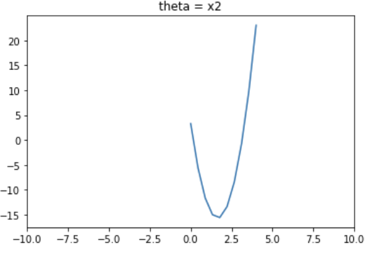
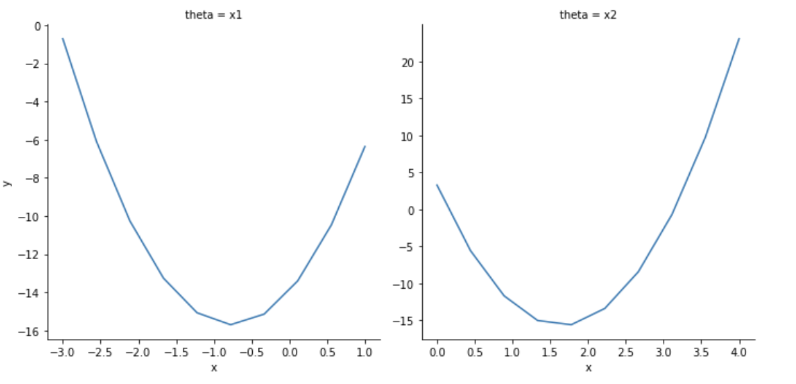

projplot
====================================

*Kanika Chopra, Martin Lysy*

---

==============================
Description
==============================

This package is created to assist with testing optimization when building optimizers by providing additional visualizations. If a plot is pinpointed to a certain area (zoomed in) or too generalized (zoomed out), there can be misinterpretations regarding optimality. For example, a graph can look as if it has (has not) reached its optimal values despite it being the opposite. Two examples of plots that are misleading despite not being at the optimal value are given below. Figure 1 shows a plot that is too zoomed in and Figure 2 shows a plot that is too zoomed out. In both of these plots, we are misled about the optimal value. 

Figure 1: A misleading plot due to being too zoomed in

.. image:: pages/images/zoomedin.png
    :alt: Plot zoomed in

Figure 2: A misleading plot due to being too zoomed in

Although the optimal value calculated for :math:`x_{2}` is is 1.647 this appears to be at 1.6 for the Figure 1 and around 2 for Figure 2. 

``projplot`` provides an additional visual assessment of optimality. A plot is generated for each theta value being optimized. This plot varies the respective theta value while holding the other variables constant. This helps to determine if the specific theta has been optimized based on an upper and lower limit (provided by the user). 

For example, if we were optimizing :math:`\theta` and :math:`\mu`, we would have one plot where :math:`\mu` is held constant and :math:`\theta` is varying. This plot would show how the results of the objective function vary based on :math:`\theta`. By analysing this plot, we are able to determine if :math:`\theta` has reached its optimal value. An example of this plot can be found below in the Usage section.

==============================
Installation
==============================

.. code::
   pip install projplot==0.0.1

You can find the package listed here: https://pypi.org/project/projplot/0.0.1/

==============================
Usage
==============================
An overview of the package functionality is illustrated with the following example. 
Let :math:`Q(x) = x^{T}Ax - 2b^{T}x` denote a quadratic objective function and :math:`x \in \Re^{d}`. If A is a positive-definite matrix, then the unique minimum of :math:`Q(x)` is :math:`\hat{x} =A^{-1}b`.

For example, let 

.. math::
   A = \begin{bmatrix}
       3 & 2 \\
       2 & 7
       \end{bmatrix}
and

.. math::
   b = \begin{bmatrix}
       1 \\
       10
       \end{bmatrix}

Then we have that the optimal solution is :math:`\hat{x} = (-0.765, 1.647)`. Now, ``projplot`` allows us to complete a visual check. As the user of this program, you will need to provide the following information:

- Objective function (``obj_fun``): This can be either a vectorized or non-vectorized function. 
-  Optimal values (``theta``): This will be the optimal solution for your function. 
-  Upper and lower bounds for each theta (``theta_lims``): This will provide an initial range of values to observe.
-  Parameter names (``theta_names``): These are the names of your parameters, i.e. theta, mu, sigma
-  Number of points to plot for each parameter (``n_pts``): This is the number of points that each parameter will be evaluated at for their respective plot. 

Setup
======

.. code:: python

    # Optimal values
    theta = np.array([-0.76470588,  1.64705882])

    # Upper and lower bounds
    theta_lims = np.array([[-3., 1], [0, 4]])

    # Parameter names
    theta_names = ["x1", "x2"]

    # Number of evaluation points per coordinate
    n_pts = 10

Vectorized Function
====================

.. code-block:: python

    from projplot import projxvals
    from projplot import projdata

    # Define vectorized function
    def obj_fun(x):
        '''
        Params: 
            x: x is a nx2 vector

        Returns:
            The output of x'Ax - 2b'x
        '''
        # Transpose the x vector so it is 2xn where n is 2 * number of data points 
        x = x.T 
        A = np.array([[3,2], [2,7]])
        b = np.array((1,10)).T
        
        y = np.diag(x.T.dot(A).dot(x)) - 2 * b.dot(x)
            
        return y

    # Generate first round of x_values
    x_vals = projxvals(theta, theta_lims, n_pts)

    # Obtain y_values and plots
    plot_data = projdata(obj_fun, x_vals, theta_names, is_vectorized=True)

Below, we have the projection plot using this data and objective function. 

.. automodule:: src.projplot.proj
    ::members:

.. toctree::
   :maxdepth: 2
   :caption: Overview

   pages/contents
   pages/examples
   pages/faq

Links
=====
* :ref:`search`
* Source code: https://github.com/kanikadchopra/projplot
* Contact: kdchopra@uwaterloo.ca