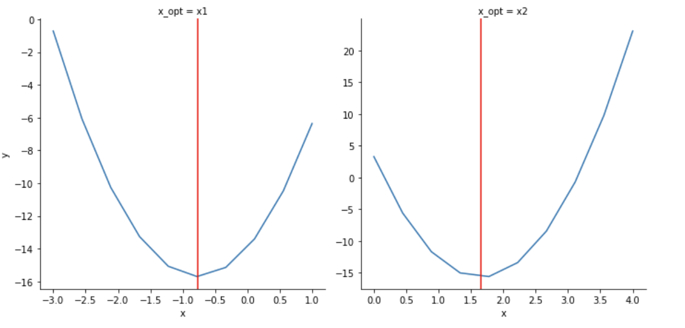

==============================
Examples
==============================
An overview of the package functionality is illustrated with the following example. Let ``Q(x) = x^TAx - 2b^Tx`` denote a quadratic objective function in ``x`` is in the d-dimensional real space. If ``A`` is a positive-definite matrix, then the unique minimum of ``Q(x)`` is ``x̂ =A^{-1}b`` (A inverse * b). 

For example, let 
    A = [[3,2],
        [2,7]]

and 
    b = [1,
        10]

Then we have that the optimal solution is ``x̂ = (-0.765, 1.647)``. Now, ``projplot`` allows us to complete a visual check. As the user of this program, you will need to provide the following information:

- Objective function (``obj_fun``): This can be either a vectorized or non-vectorized function. 
-  Optimal values (``theta``): This will be the optimal solution for your function. 
-  Upper and lower bounds for each theta (``theta_lims``): This will provide an initial range of values to observe.
-  Parameter names (``theta_names``): These are the names of your parameters, i.e. theta, mu, sigma
-  Number of points to plot for each parameter (``n_pts``): This is the number of points that each parameter will be evaluated at for their respective plot. 

Setup
======

.. code:: python

    # Optimal values
    theta = np.array([-0.76470588,  1.64705882])

    # Upper and lower bounds
    theta_lims = np.array([[-3., 1], [0, 4]])

    # Parameter names
    theta_names = ["x1", "x2"]

    # Number of evaluation points per coordinate
    n_pts = 10

Vectorized Function
====================

.. code:: python

    import projplot as pjp

    # Define vectorized function
    def obj_fun(x):
        '''
        Params: 
            x: x is a nx2 vector

        Returns:
            The output of x'Ax - 2b'x
        '''
        # Transpose the x vector so it is 2xn where n is 2 * number of data points 
        x = x.T 
        A = np.array([[3,2], [2,7]])
        b = np.array((1,10)).T
        
        y = np.diag(x.T.dot(A).dot(x)) - 2 * b.dot(x)
            
        return y

    # Generate first round of x_values
    x_vals = pjp.proj_xvals(theta, theta_lims, n_pts)

    # Obtain y_values and plots
    plot_data = pjp.proj_data(fun=obj_fun, x_vals=x_vals, x_names=theta_names, vectorized=True)
    
    # Plot vertical line at optimal values
    pjp.proj_plot_show(plot_data, vlines=theta)
    pjp.proj_plot_show(plot_data)

Below, we have the projection plot using this data and objective function with and without the vertical lines.

.. image:: images/plot1.png
    :alt: Plot from vectorized function

Non-Vectorized Function
========================

.. code:: python

    import projplot as pjp

    # Define function
    def obj_fun(x):
        '''
        Params: 
            x: x is a 2x1 vector

        Returns:
            The output of x'Ax - 2b'x
        '''
        A = np.array([[3,2], [2,7]])
        b = np.array((1,10)).T 
        
        y = x.dot(A) @ x - 2 * b.dot(x) 

        return y

    # Generate first round of x_values
    x_vals = pjp.proj_xvals(theta, theta_lims, n_pts)

    # Obtain y_values and plots
    plot_data = pjp.proj_data(fun=obj_fun, x_vals=x_vals, x_names=theta_names, vectorized=False)
    pjp.proj_plot_show(plot_data)

Below, we have the projection plot using this data and objective function. 

.. image:: images/plot2.png
    :alt: Plot from non-vectorized function

We can see that the produced plots for the vectorized and non-vectorized function are identical. Vectorized functions have the advantage of running more efficiently; however, are not necessary to utilize this tool.
