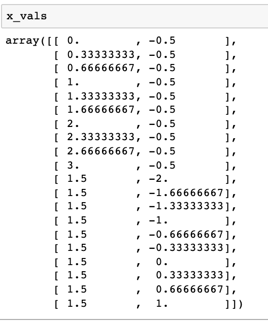
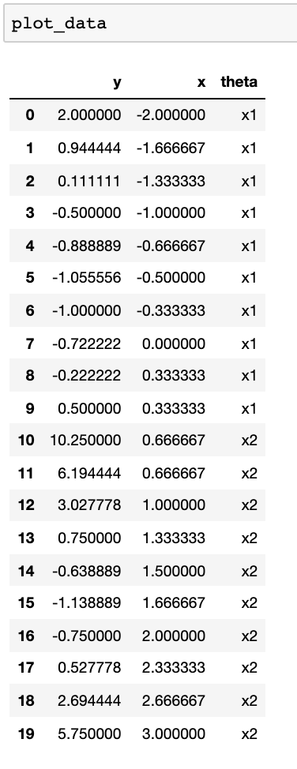

=========
FAQ
=========

Does my function need to be vectorized?
========================================

No, it does not need to be vectorized in order for you to use this tool. There is a ``is_vectorized`` parameter that allows for both vectorized functions and non-vectorized functions. If your function is not vectorized, we will iterate through the x-values to generate the x-value matrix that will be used for the projection plots. If your function is vectorized, this will run more efficiently with generating the projection plots. 

What is the point of generating the x-value matrix separately?
================================================================

The x-value matrix generates the combinations with the varying thetas that we will be inputting into the objective function to visualize the resulting changes in the output. By having this outputted separately, the user is able to view the values that will be inputted prior to plotting and alter it. In the future, an ``equalize()`` function will be added to fine-tune the scale to be more accurate. An example of what the x-value matrix looks like is given below (based on the example above): 

Can I see the data that is plotted as a DataFrame?
=====================================================

In the examples, you'll notice that the output of ``proj_plot()`` and ``proj_data()`` are assigned to the variable ``plot_data``. If we were to call the ``plot_data`` variable, we would have the following DataFrame outputted (based on the example above):

Do I have to include names for each parameter?
================================================

No, as a default if the list of names is empty, the function will label them x1,x2,...,xp based on p parameters. 

What is the point of the x_vline parameter?
================================================

This allows the user to see where the solution for each parameter lies on the plot. For exxample, if the projection plot is given for values between -2 and 2 and was minimized at 0, if we believed the minimum was at -1, we would be able to visually tell that our optimization didn't work since the vertical line would not be at 0. 

*This package will have a similar goal to OptimCheck in R.*

