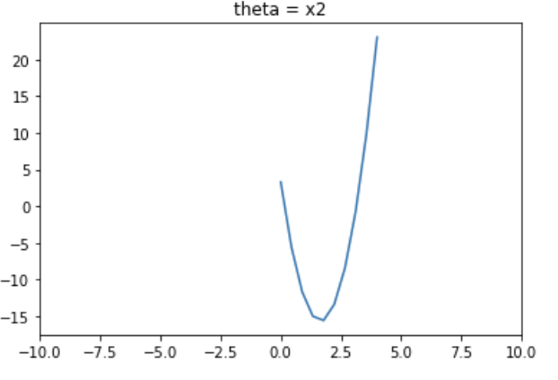

==============================
Objective
==============================

This package is created to assist with testing optimization when building optimizers by providing additional visualizations. If a plot is pinpointed to a certain area (zoomed in) or too generalized (zoomed out), there can be misinterpretations regarding optimality. For example, a graph can look as if it has (has not) reached its optimal values despite it being the opposite. Two examples of plots that are misleading despite not being at the optimal value are given below. Figure 1 shows a plot that is too zoomed in and Figure 2 shows a plot that is too zoomed out. In both of these plots, we are misled about the optimal value. 

Figure 1: A misleading plot due to being too zoomed in

.. image:: images/zoomedin.png
    :alt: Plot zoomed in

Figure 2: A misleading plot due to being too zoomed in

Although the optimal value calculated for x2 is is 1.647 this appears to be at 1.6 for the Figure 1 and around 2 for Figure 2. 

``projplot`` provides an additional visual assessment of optimality. A plot is generated for each theta value being optimized. This plot varies the respective theta value while holding the other variables constant. This helps to determine if the specific theta has been optimized based on an upper and lower limit (provided by the user). 

For example, if we were optimizing ``theta`` and ``mu``, we would have one plot where ``mu`` is held constant and ``theta`` is varying. This plot would show how the results of the objective function vary based on ``theta``. By analysing this plot, we are able to determine if ``theta`` has reached its optimal value. An example of this plot can be found in the Examples section.